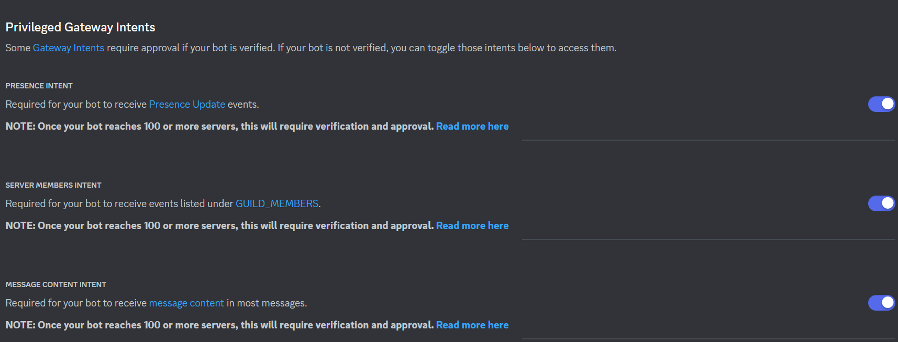

# offrec

## About

Discordサーバー内の指定チャンネルでメッセージの自動削除を行うDiscord Botです。  
監視対象として登録されたチャンネルに投稿されたメッセージを一定時間後に自動削除します。（デフォルトでは1日）  

## Botの機能

### チャンネル登録

- スラッシュコマンド `/register-channel` で監視対象チャンネルを登録
- サーバー内のテキストチャンネル一覧から選択可能

### 履歴一括削除

- スラッシュコマンド `/cleanup-history` で過去のメッセージを削除キューに登録
- `/register-channel` と同様にチャンネルを選択して実行

### チャンネルの監視

- 登録されたチャンネルに投稿されたメッセージをキューイング

### メッセージ自動削除機能

- 削除対象のメッセージをキューから取得し、一定時間が経過したメッセージを削除する

## DBのマイグレーション方法

### require

- [Command-line - Command-line tool - Flyway by Redgate • Database Migrations Made Easy.](https://flywaydb.org/documentation/usage/commandline/)
- [Task](https://taskfile.dev/)

## 手順

tbd

## Discordの設定

## Botの権限設定

tbd

## 環境変数

| 変数名                     | 説明                     | 補足                      |
| -------------------------- | ------------------------ | ------------------------- |
| OFFREC_DISCORD_TOKEN       | DiscordのBotのトークン   | Developer Portal から取得 |
| OFFREC_DB_DEFAULT_HOST     | データベースのホスト     |                           |
| OFFREC_DB_DEFAULT_PORT     | データベースのポート     |                           |
| OFFREC_DB_DEFAULT_NAME     | データベースの名前       |                           |
| OFFREC_DB_DEFAULT_USER     | データベースのユーザー名 |                           |
| OFFREC_DB_DEFAULT_PASSWORD | データベースのパスワード |                           |
| OFFREC_LOG_PATH            | ログファイルの出力先     |                           |
